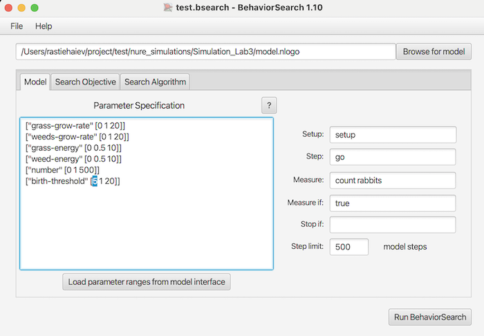
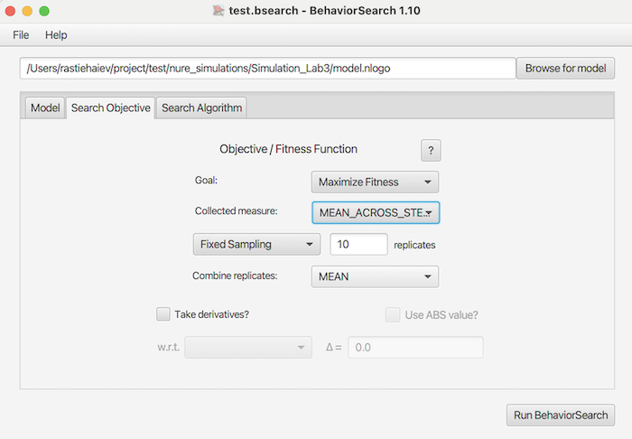
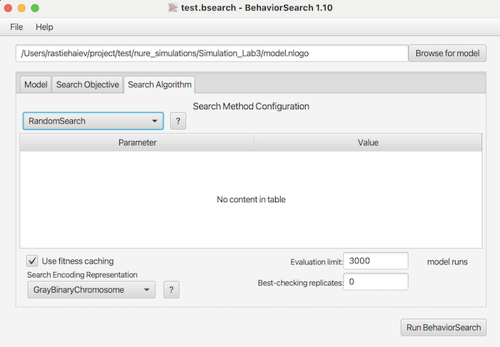
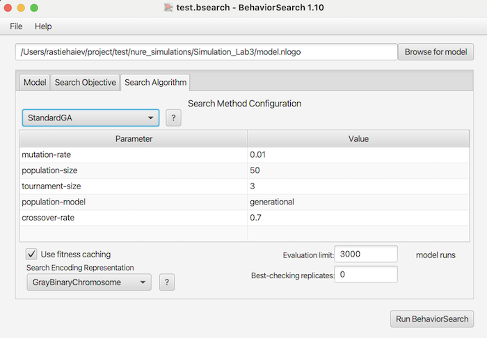
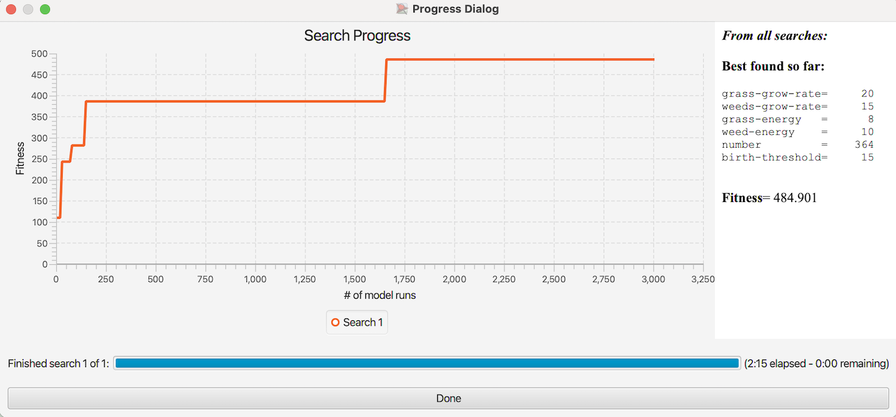
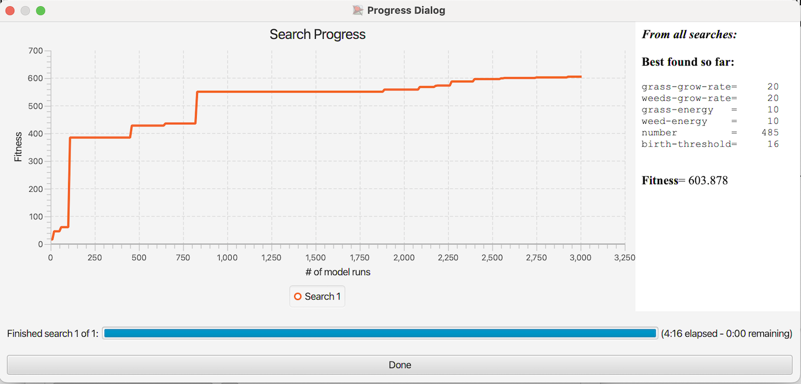
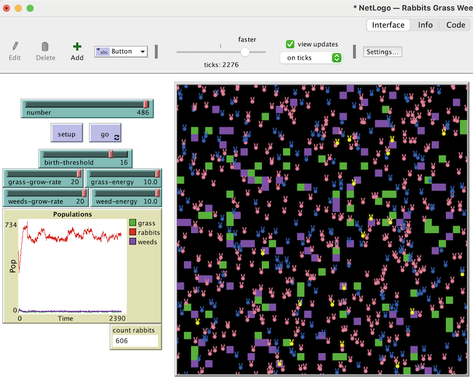

## Комп'ютерні системи імітаційного моделювання
## СПм-23-4, **Ніколаєв Олексій Євгенович**
### Лабораторна робота №**3**. Використання засобів обчислювального інтелекту для оптимізації імітаційних моделей

### Варіант 6, модель у середовищі NetLogo:
[Rabbits Grass Weeds](http://www.netlogoweb.org/launch#http://www.netlogoweb.org/assets/modelslib/Sample%20Models/Biology/Rabbits%20Grass%20Weeds.nlogo)

### Вербальний опис моделі:
Моделювання ключових принципів взаємодії у спільноті організмів. Система включає три основні складові екосистеми: трава (основне джерело харчування для кроликів), кролики (споживають траву як головну їжу) і бур’ян (рослини, що конкурують із травою за ресурси, але не є основною їжею для кроликів).
У цій екологічній моделі взаємодії між цими трьома складовими дозволяють досліджувати такі явища, як динаміка популяцій, відносини хижак-жертва та конкуренція між рослинними видами.

### Керуючі параметри:
- **number-of-rabbits** визначає кількість агентів у середовищі моделювання, тобто, в даній моделі, початкова кількість кроликів.
- **birth-threshold** визначає кількість енергії, необхідної агенту для репродукції.
- **grass-grow-rate** визначає темп зростання трави з кожним ігровим тактом.
- **grass-energy** визначає кількість енергії, яку отримує кролик споживаючи траву.
- **weeds-grow-rate** визначає темп зростання бурʼяну в кожному ігровому такті.
- **weeds-energy** визначає кількість енергії, яку отримує кролик споживаючи бурʼян.

### Показники роботи системи:
- поточна кількість трави,
- поточна кількість бурʼяну,
- поточна популяція кроликів.

### Налаштування середовища BehaviorSearch:

**Обрана модель** 
Візьмемо модифікований варіант моделі з ЛР №2. Зміни моделі, які були додані в ЛР №2:
- Додано можливість отруїтися при поїданні бур'янів (зазначена у внутрішніх параметрах, як певна вірогідність). Захворілий кролик не може харчуватися, переміщатися і розмножуватися, позначається іншим кольором і залишається хворим на 3 такти модельного часу.
- Додано поділ кроликів на самців та самок.
- Поява нових кроликів має вимагати не тільки ситості, а й здоров'я, та присутності в одній із сусідніх клітин іншого ситого здорового кролика протилежної статі.
- Поява потомства відбувається із ймовірністю 50%.
- Додано кожному кролику "вік" - кількість тактів, після яких кролик "помирає".
- Додано можливість народжувати тільки кроликам жіночої статі (рандомно одного або двох). Кролики чоловічої статі тільки втрачають енергію.

**Параметри моделі** 
*Параметри та їх діапазони були автоматично вилучені середовищем BehaviorSearch із вибраної імітаційної моделі, для цього скористаємось кнопкою «Load parameter ranges from model interface»*:
<pre>
["grass-grow-rate" [0 1 20]]
["weeds-grow-rate" [0 1 20]]
["grass-energy" [0 0.5 10]]
["weed-energy" [0 0.5 10]]
["number" [0 150 500]]
["birth-threshold" [5 1 20]]
</pre>

*Нижнє значення кількість енергії, необхідної кролику для репродукції, було збільшено з 0 до 5 для того, щоб зімітувати більш реальний сценарій.*

**Міра фітнес-функції** 
В якості міри для фітнес-функції використано значення популяції кроликів в середовищі існування. Вираз цієї міри узято з налаштувань графіка імітаційної моделі в середовищі NetLogo:
<pre>
count rabbits
</pre>

Кількість кроликів в середовищі існування має враховуватися **в середньому** за весь період симуляції тривалістю 500 тактів (адже в кожному такті це значення відрізняється), починаючи з 0 такту симуляції (параметр **Step limit**).
Цього можна досягти за допомоги параметру "**Measure if**" зі значенням *true*.
Іноді має сенс не враховувати деякі такти через хаос у деяких моделях на початку їх використання. Для цього можна було б вказати специфічні умови в параметрі "**Measure if**".

Параметри "**Setup**" та "**Go**" мають вказувати на відповідні процедури ініціалізації та запуску у логіці моделі.
BehaviorSearch в процесі роботи замість користувача запускає ці процедури.
Параметр зупинки за умовою ("**Stop if**") в цій ЛР не використовується.

Скриншот панелі налаштування параметрів приведено на малюнку: 
 

**Налаштування цільової функції** (Search Objective) 
Ціль налаштування параметрів імітаційної моделі – збільшити середню популяцію кроликів у середовищі існування (тобто знайти такі параметри моделі, при яких середня кількість кроликів буде максимальною).
Це досягається шляхом вибору значення Maximize Fitness для параметра **Goal**.
Важливо зазначити, що нас цікавить не популяція кроликів у конкретний момент часу, а середнє значення протягом усієї симуляції, яка триває 500 кроків. Для цього в параметрі **Collected measure** слід зазначити значення **MEAN_ACROSS_STEPS**.
Щоб мінімізувати вплив випадковості, яка присутня в логіці моделі, кожна симуляція виконується 10 разів, а підсумковий результат обчислюється як середнє арифметичне.

Скриншот панелі налаштування параметрів цільової функції: 
 

**Налаштування алгоритму пошуку** (Search Algorithm) 
На цьому етапі визначено модель, налаштовано її параметри та обрано міру ефективності, яка є основою функції пристосованості. Це дозволяє оцінювати "якість" кожного з варіантів рішень, що перевіряються в BehaviorSearch.
У дослідженні застосовуватимуться два алгоритми: випадковий пошук (RandomSearch) та простий генетичний алгоритм (StandardGA). Для цих алгоритмів необхідно вказати параметри: **Evaluation limit** (кількість ітерацій пошуку, для GA це відповідає числу поколінь) та **Search Space Encoding Representation** (метод кодування варіантів рішень).
Оскільки загальноприйнятого "найкращого" способу кодування немає, необхідно підібрати той, що найкраще підходить для поточної моделі. Параметр **Use fitness caching** стосується лише продуктивності й не впливає на результати.
Налаштування **RandomSearch** алгоритму пошуку: 
 

Параметри, специфічні для генетичного алгоритму, можна використовувати за замовчуванням, якщо це не перешкоджає отриманню результату. 

Налаштування *StandardGA* алгоритму пошуку: 
 

### Результати використання BehaviorSearch:

Було проведено експерименти з усіма доступними налаштуваннями параметра "**Search Space Encoding Representation**".
Нижче наведено таблицю результатів Fitness:

<table>
<thead>
<tr><th></th><th>GrayBinary</th><th>StandardBinary</th><th>MixedType</th><th>RealHypercube</th></tr>
</thead>
<tbody>
<tr><td>RandomSearch</td><td>484.9</td><td>484.9</td><td>478.9</td><td>456.2</td></tr>
<tr><td>StandardGA</td><td>496.2</td><td>579.6</td><td>603.9</td><td>591.7</td></tr>
</tbody>
</table>

Нижче представлені скриншоти найуспішніших експериментів (тих, в яких ми отримали найбільше значення Fitness).

Результат пошуку параметрів імітаційної моделі, використовуючи **випадковий пошук** (RandomSearch, GrayBinaryChromosome): 
 
Результат пошуку параметрів імітаційної моделі, використовуючи **генетичний алгоритм** (StandardGA, RealHypercubeChromosome): 
 

Для наглядності доданий результат роботи моделі в середовищі NetLogo з параметрами найуспішнішого експерименту: 
 
